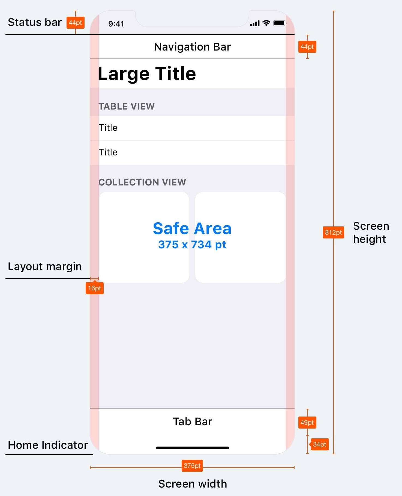
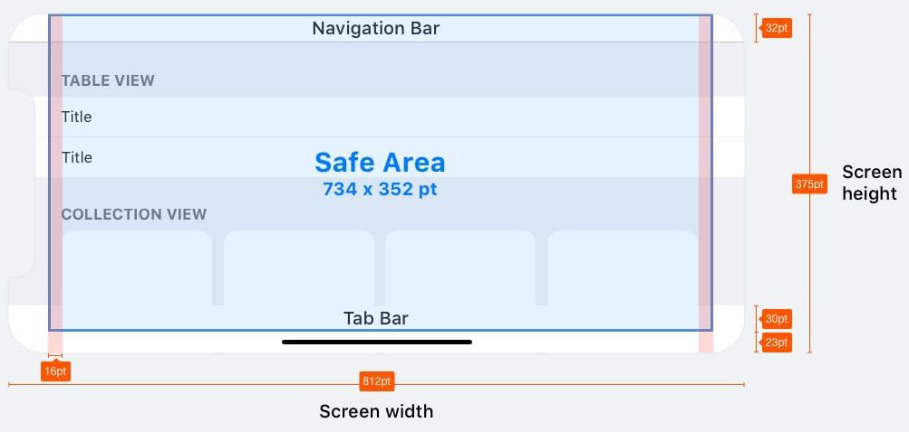
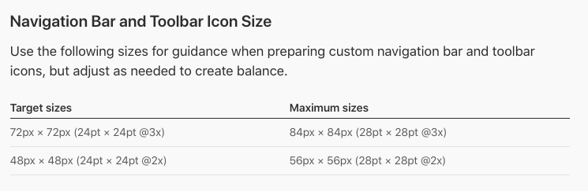

# App Know How

 iOS、Andorid系統年年更新，這篇文章大致講解目前（～2019年9月）經歷的案子中要注意的事項。
 ## ios 
 * [Human Interface Guidelines](https://developer.apple.com/design/human-interface-guidelines/)
 * [Fonts](https://developer.apple.com/fonts/)
 * [Design Resources](https://developer.apple.com/design/resources/)
 * [What's New in iOS Design](https://developer.apple.com/videos/play/wwdc2019/808/)
 * [New features available with iOS 13](https://www.apple.com/ios/ios-13/features/)

iOS官方的建議規範，列出比較常遇到需要注意的地方。

* Safe Area
 針對iphoneX之後的機型

* [Custom Icon Sizes](https://developer.apple.com/design/human-interface-guidelines/ios/icons-and-images/custom-icons/)
 建議icon尺寸30x30，[參考文章](https://medium.com/as-a-product-designer/寫給不是工程師的-ios切圖-2c6e9dc8abb)

##  Andorid
 * [MATERIAL DESIGN](https://material.io/)
 * [What’s New With Android 10](https://www.youtube.com/watch?v=1-AozVirb88&list=PLOcMSsuppV4q38HhyXXRPxFpwbX_04jf3)
 

##  其他工具
* 參考文章 [如何透過Sketch提高設計工作效率(上)](https://medium.com/as-a-product-designer/%E5%A6%82%E4%BD%95%E9%80%8F%E9%81%8Esketch%E6%8F%90%E9%AB%98%E8%A8%AD%E8%A8%88%E5%B7%A5%E4%BD%9C%E6%95%88%E7%8E%87-%E4%B8%8A-31014f523070)
* 參考文章 [如何透過Sketch提高設計工作效率(下)](https://medium.com/as-a-product-designer/如何透過sketch提高設計工作效率-下-997189c474fd)
